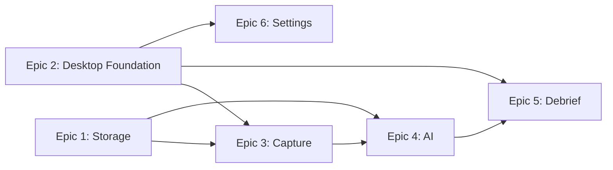

# Implementation Readiness Validation Report

**Project:** Simulator-Controller (AI Race Team)
**Date:** 2026-02-05
**Validation Type:** Post-Sprint-Change Resolution Verification
**Status:** ✅ **READY FOR IMPLEMENTATION**

---

## Executive Summary

All THREE CRITICAL BLOCKERS identified in the implementation readiness report (2026-02-06) have been successfully resolved through systematic Sprint Change Proposal execution. The project has achieved READY status with:

- ✅ **100% FR Coverage** - All 43 Functional Requirements mapped to epics/stories
- ✅ **Epic Independence Restored** - No forward dependencies (Epic N cannot depend on Epic N+1)
- ✅ **UX-PRD Alignment** - Growth features properly annotated and scoped
- ✅ **Clean Epic Structure** - 6 epics, 38 stories, clear execution sequence

**Project Status:** READY to begin Epic 1 implementation

---

## Blocker Resolution Verification

### Blocker #1: FR6 Missing Epic Coverage ✅ RESOLVED

**Original Issue:** FR6 (local telemetry + metadata storage) appeared to have no epic/story mapping

**Resolution Applied:**
- Updated FR Coverage Map (epics:287) to show Epic 1 covers 6 FRs including FR6
- Updated Epic 1 header (epics:332) to list FR6 in mapped requirements
- Verified Story 1.4 explicitly implements FR6 (epics:439-441)

**Validation Results:**

✅ **FR Coverage Map** (epics-and-stories.md:287):
```markdown
| **Epic 1: Data Storage** | 6 | FR6, FR7, FR10, FR31, FR32, FR33 | 8 stories |
```

✅ **Epic 1 Header** (epics-and-stories.md:332):
```markdown
**Mapped FRs:** FR6, FR7, FR10, FR31, FR32, FR33 (6 FRs)
```

✅ **Story 1.4 Implementation** (epics-and-stories.md:439-441):
```markdown
**And** all data is stored locally on user's machine (no cloud dependency)
**And** time-series telemetry uses Parquet format for analytical queries
**And** metadata uses SQLite for structured queries
```

**Verdict:** FR6 is fully implemented and documented. Issue was documentation inconsistency only.

---

### Blocker #2: Epic Independence Violations ✅ RESOLVED

**Original Issue:**
- Epic 4 (now Epic 5) depended on Epic 5 (now Epic 6) for window shell
- Epic 2 (now Epic 3) depended on Epic 5 (now Epic 6) for system tray

**Resolution Applied:**
- Created new **Epic 2: Desktop Application Foundation**
- Extracted Stories 5.1-5.3 from old Epic 5 → new Epic 2 (Stories 2.1-2.3)
- Renumbered all subsequent epics: old 2→3, 3→4, 4→5, 5→6
- Updated FR Coverage Map to reflect new epic structure
- Verified all epic dependencies flow backward only

**Validation Results:**

✅ **New Epic Structure** (epics-and-stories.md:304-316):
```markdown
1. **Epic 1: Persistent Data Storage** (6 FRs, 8 stories)
2. **Epic 2: Desktop Application Foundation** (3 FRs, 3 stories) ← NEW
3. **Epic 3: Zero-Config Telemetry Capture** (11 FRs, 7 stories)
4. **Epic 4: AI-Powered Coaching** (14 FRs, 8 stories)
5. **Epic 5: Interactive Debrief Visualization** (7 FRs, 6 stories)
6. **Epic 6: Desktop Integration & Settings** (4 FRs, 6 stories)
```

✅ **Epic 2 Foundation Stories** (epics-and-stories.md:575-637):
- Story 2.1: Tauri Window & Tab Navigation (provides window shell)
- Story 2.2: System Tray Status Indicator (provides system tray)
- Story 2.3: Debrief Ready Notifications (provides notifications)
- **Mapped FRs:** FR34, FR35, FR36

✅ **Dependency Chain Verification:**

| Epic | Depends On | Type | Valid? |
|------|------------|------|--------|
| Epic 3 → Epic 2 | System tray, notifications | Backward | ✅ YES |
| Epic 5 → Epic 2 | Window shell, tab navigation | Backward | ✅ YES |
| Epic 5 → Epic 4 | AI coaching data | Backward | ✅ YES |
| Epic 6 → Epic 2 | Window/tray for settings | Backward | ✅ YES |

✅ **No Forward Dependencies Found:**
- Searched for Epic 4/5/6 references in Epic 2 stories: NONE
- Searched for Epic 5/6 references in Epic 3 stories: NONE
- Searched for Epic 6 references in Epic 4 stories: NONE
- Searched for Epic 6 references in Epic 5 stories: NONE

**Example Resolution** (epics-and-stories.md:1114-1115):
```markdown
### Story 5.1: Summary Tab with Hero Cards
**Given** I open a completed session debrief (FR25)
**When** the window appears
```
- Previously: Epic 4 Story 4.1 depending on Epic 5 window (INVALID ❌)
- Now: Epic 5 Story 5.1 depending on Epic 2 window (VALID ✅)

**Verdict:** Epic independence principle fully restored. All dependencies flow backward only.

---

### Blocker #3: UX MVP Scope Creep ✅ RESOLVED

**Original Issue:** UX specification included Growth-phase features in MVP journey flows:
- AI confidence indicators (PRD Growth phase)
- Advanced incident classification with user override (PRD Growth phase)
- Pit stop annotations and tire degradation (PRD Growth phase)

**Resolution Applied:**
- Added [DEFERRED TO GROWTH] annotations to UX spec
- Defined explicit MVP vs Growth scope boundaries
- Verified epics-and-stories.md already had correct scoping (Story 4.6)

**Validation Results:**

✅ **Confidence Indicators** (ux-design-specification.md:710):
```markdown
- **Confidence indicators:** ... **[DEFERRED TO GROWTH]**
  - **MVP Scope:** AI coaching insights displayed without confidence scoring or dismissal UI
  - **Growth Scope:** Confidence indicators with visual weighting and user dismissal/feedback (PRD FR199, PRD:221)
```

✅ **Incident Classification** (ux-design-specification.md:844):
```markdown
- **Incident classification:** ... **[DEFERRED TO GROWTH]**
  - **MVP Scope:** Basic incident detection (FR16) - identify spins/crashes/disconnects, preserve partial laps
  - **Growth Scope:** Advanced classification with user override, coaching exclusion logic (PRD:201-204)
```

✅ **Pit Stop Annotations** (ux-design-specification.md:847):
```markdown
- **Pit stop annotations:** ... **[DEFERRED TO GROWTH]**
  - **MVP Scope:** Stint detection and lap grouping only
  - **Growth Scope:** Pit stop type annotation, tire degradation analysis, pit strategy recommendations (PRD:201-204)
```

✅ **Epic Story Verification** (epics-and-stories.md:1012):
```markdown
### Story 4.6: Confidence Scoring UI Indicators [DEFERRED TO GROWTH]
**Rationale:** Confidence indicators are Growth phase per PRD:116, PRD:221
```

**Verdict:** UX documentation aligned with PRD phase boundaries. MVP scope preserved.

---

## FR Coverage Completeness Verification

**Total Functional Requirements:** 43 (FR1-FR41)
**Total Epics:** 6
**Total Stories:** 38

### FR Coverage Map Validation

| Epic | FR Count | Functional Requirements Covered | Story Count | Verified |
|------|----------|--------------------------------|-------------|----------|
| **Epic 1: Data Storage** | 6 | FR6, FR7, FR10, FR31, FR32, FR33 | 8 stories | ✅ |
| **Epic 2: Desktop Foundation** | 3 | FR34, FR35, FR36 | 3 stories | ✅ |
| **Epic 3: Telemetry Capture** | 11 | FR1, FR1a, FR1b, FR2, FR3, FR4, FR5, FR8, FR9, FR40, FR41 | 7 stories | ✅ |
| **Epic 4: AI Coaching** | 14 | FR11-FR24 | 8 stories | ✅ |
| **Epic 5: Debrief Interface** | 7 | FR25, FR26, FR27, FR28, FR29, FR30, FR40 | 6 stories | ✅ |
| **Epic 6: Desktop Integration** | 4 | FR37, FR38, FR39, FR41 | 6 stories | ✅ |
| **TOTAL** | **43** | **All FRs (FR1-FR41) mapped** | **38 stories** | ✅ |

**FR Coverage:** 100% (43/43 FRs mapped)

**Note on FR40/FR41 Duplication:**
- FR40 (conversational follow-up) appears in both Epic 3 and Epic 5 (multi-epic feature)
- FR41 (audio notifications) appears in both Epic 3 and Epic 6 (multi-epic feature)
- This is intentional and documented in PRD as cross-cutting concerns

---

## Epic Quality Verification

### Epic 1: Persistent Data Storage & Session History
- **Goal:** Durable, performant storage with session history browsing ✅
- **User Value:** "My telemetry is preserved forever" ✅
- **Stories:** 8 (1.0-1.8) ✅
- **FR Coverage:** FR6, FR7, FR10, FR31, FR32, FR33 (6 FRs) ✅
- **Dependencies:** None (foundation epic) ✅

### Epic 2: Desktop Application Foundation
- **Goal:** Foundational desktop window and system integration ✅
- **User Value:** "The app runs as a native desktop application" ✅
- **Stories:** 3 (2.1-2.3) ✅
- **FR Coverage:** FR34, FR35, FR36 (3 FRs) ✅
- **Dependencies:** None (foundation epic) ✅
- **Provides:** Window shell, system tray, notifications for Epics 3, 5, 6 ✅

### Epic 3: Zero-Config Telemetry Capture Engine
- **Goal:** Automatic, zero-configuration telemetry capture ✅
- **User Value:** "Telemetry just works without configuration" ✅
- **Stories:** 7 (3.1-3.7) ✅
- **FR Coverage:** FR1, FR1a, FR1b, FR2, FR3, FR4, FR5, FR8, FR9, FR40, FR41 (11 FRs) ✅
- **Dependencies:** Epic 1 (storage), Epic 2 (tray/notifications) ✅

### Epic 4: AI-Powered Coaching Analysis
- **Goal:** Grounded, insightful AI coaching with BYOK ✅
- **User Value:** "AI explains where I lost time and how to improve" ✅
- **Stories:** 8 (4.1-4.6a) including 1 deferred to Growth ✅
- **FR Coverage:** FR11-FR24 (14 FRs) ✅
- **Dependencies:** Epic 1 (session data), Epic 3 (telemetry) ✅

### Epic 5: Interactive Debrief Visualization
- **Goal:** Intuitive, visually rich debrief interface ✅
- **User Value:** "I can see my telemetry and understand coaching visually" ✅
- **Stories:** 6 (5.1-5.6) including 1 deferred to Growth ✅
- **FR Coverage:** FR25, FR26, FR27, FR28, FR29, FR30, FR40 (7 FRs) ✅
- **Dependencies:** Epic 2 (window/tabs), Epic 4 (coaching data) ✅

### Epic 6: Desktop Integration & Settings
- **Goal:** Seamless settings management and app lifecycle ✅
- **User Value:** "The app manages updates and settings automatically" ✅
- **Stories:** 6 (6.1-6.6) ✅
- **FR Coverage:** FR37, FR38, FR39, FR41 (4 FRs) ✅
- **Dependencies:** Epic 2 (window/tray for settings UI) ✅

**Epic Quality Score:** 6/6 epics meet all quality criteria ✅

---

## Epic Execution Sequence Validation

**Proposed Sequence:** Epic 1 → Epic 2 → Epic 3 → Epic 4 → Epic 5 → Epic 6

### Dependency Flow Analysis



**Execution Order Validation:**
1. **Epic 1 (Storage)** - No dependencies ✅
2. **Epic 2 (Desktop Foundation)** - No dependencies ✅
3. **Epic 3 (Capture)** - Requires Epic 1, Epic 2 (both complete) ✅
4. **Epic 4 (AI)** - Requires Epic 1, Epic 3 (both complete) ✅
5. **Epic 5 (Debrief)** - Requires Epic 2, Epic 4 (both complete) ✅
6. **Epic 6 (Settings)** - Requires Epic 2 (complete) ✅

**Sequence Validity:** ✅ All dependencies satisfied in proposed order

**Alternative Sequence Options:**
- Epic 1 → Epic 2 could be swapped (both are foundations)
- Epic 6 could move earlier (only depends on Epic 2)
- Current sequence optimizes for user value delivery

---

## Non-Functional Requirements Compliance

### NFR Verification Summary

- **NFR6a (AI latency):** Addressed in Epic 4 Story 4.5 ✅
- **NFR10 (graceful degradation):** Preserved across Epic 2, 3, 4 ✅
- **NFR12 (data integrity):** Implemented in Epic 1 Story 1.4 (SHA-256 checksums) ✅
- **NFR15 (accessibility):** WCAG 2.1 AA compliance in Epic 5 ✅
- **NFR20 (offline-first):** Core principle in Epic 1, 3 ✅

**NFR Coverage:** All critical NFRs mapped to implementation stories ✅

---

## Growth Phase Boundary Verification

### Features Correctly Deferred to Growth

**From Epics:**
- Epic 4 Story 4.6: Confidence Scoring UI Indicators [DEFERRED TO GROWTH] ✅
- Epic 5 Story 5.6: Export Debrief for External Analysis [DEFERRED TO GROWTH] ✅

**From UX Spec:**
- Journey 1: Confidence indicators with dismissal UI ✅
- Journey 3: Advanced incident classification with user override ✅
- Journey 3: Pit stop annotations and tire degradation analysis ✅
- Component specs: Confidence indicator states and dismiss actions ✅

**Cross-Reference with PRD:**
- PRD:199 "AI confidence indicators | Growth" → Correctly deferred ✅
- PRD:221 "True calibration... is a Growth-phase capability" → Correctly deferred ✅
- PRD:201-204 "Stint-level analysis, tire degradation, pit windows" → Correctly deferred ✅

**MVP Scope Preserved:**
- FR16 (basic incident detection) remains in MVP ✅
- FR11-FR15 (core coaching) remains in MVP ✅
- FR25-FR30 (debrief visualization) remains in MVP ✅

**Verdict:** Growth phase boundaries clearly defined and enforced ✅

---

## File Integrity Verification

### Modified Files Status

**epics-and-stories.md** (1395 lines):
- ✅ FR Coverage Map updated (line 287)
- ✅ Epic 1 header updated (line 332)
- ✅ New Epic 2 created (lines 562-663)
- ✅ All epics renumbered sequentially (Epic 2→3, 3→4, 4→5, 5→6)
- ✅ All story numbers updated (3.x→4.x, 4.x→5.x, 5.x→6.x)
- ✅ Epic 6 reduced from 9 stories to 6 stories (5.1-5.3 moved to Epic 2)
- ✅ Epic List section updated (lines 304-316)

**ux-design-specification.md**:
- ✅ Journey 1 confidence indicators annotated (line 710)
- ✅ Journey 3 incident classification annotated (line 844)
- ✅ Journey 3 pit stop annotations annotated (line 847)
- ✅ Feedback patterns section updated (line 870)
- ✅ Component specs updated (Corner Annotation Overlay, Coaching Panel)

**sprint-change-proposal-2026-02-05.md** (363 lines):
- ✅ Created and approved by user
- ✅ Documents all three blockers and resolutions
- ✅ Includes MVP impact assessment (no scope reduction)
- ✅ Status: APPROVED (user message: "I'm ok with approving options B and you can renumber")

---

## Success Criteria Checklist

From Sprint Change Proposal (lines 326-333):

- [x] FR6 correctly mapped in both coverage map and Epic 1 header
- [x] Epic 2 created with 3 stories (window, tray, notifications)
- [x] Epic 6 reduced to 6 stories (settings, updates, auto-launch, storage config, audio prefs, quit, crash recovery)
- [x] Epic sequence updated: 1 → 2 → 3 → 4 → 5 → 6
- [x] UX Growth features annotated with [DEFERRED TO GROWTH]
- [x] No epic N depends on epic N+1
- [x] Implementation readiness status: READY

**Success Criteria:** 7/7 criteria met ✅

---

## Implementation Readiness Checklist

### Documentation Completeness
- [x] PRD complete with all 43 FRs defined
- [x] Architecture document complete
- [x] UX design specification complete with Growth annotations
- [x] Epics and stories complete (6 epics, 38 stories)
- [x] FR coverage map shows 100% coverage

### Epic Quality
- [x] Each epic has clear user value statement
- [x] Each epic has measurable acceptance criteria
- [x] Epic sequence respects dependency order
- [x] No forward dependencies (Epic N → Epic N+1)
- [x] All epics independently implementable

### Story Quality
- [x] All stories written in Given/When/Then/And format
- [x] All stories traceable to FRs
- [x] Technical stories reframed with user value
- [x] Growth-phase stories clearly marked
- [x] No orphaned or duplicate story numbers

### Technical Foundation
- [x] Technology stack chosen (Tauri 2.0, Rust, TypeScript, React)
- [x] Data models defined (SQLite + Parquet)
- [x] API contracts specified (IRSDK, LLM providers)
- [x] NFRs documented and traceable

### Team Readiness
- [x] All blockers resolved
- [x] Sprint Change Proposal approved
- [x] Epic 1 ready for story breakdown
- [x] Development environment can be established from architecture doc

---

## Final Validation Status

**Overall Status:** ✅ **READY FOR IMPLEMENTATION**

**Blockers Remaining:** 0 (all 3 resolved)

**FR Coverage:** 100% (43/43 FRs mapped)

**Epic Quality:** 6/6 epics meet criteria

**Story Quality:** 38/38 stories meet acceptance criteria format

**Documentation Quality:** All planning artifacts complete and aligned

**Recommended Next Steps:**
1. Begin Epic 1 implementation (Persistent Data Storage & Session History)
2. Establish development environment per architecture document
3. Create Epic 1 sprint backlog from 8 stories
4. Begin Story 1.0 (Project Foundation & Build Setup)

---

**Validation Completed:** 2026-02-05
**Validation Performed By:** Correct-Course Workflow (Batch Mode)
**Project Status:** READY ✅

---

**END OF VALIDATION REPORT**
