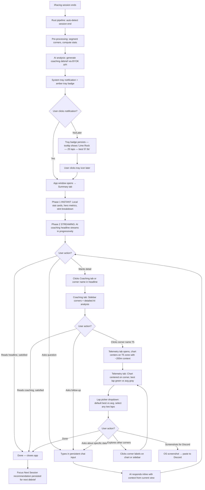
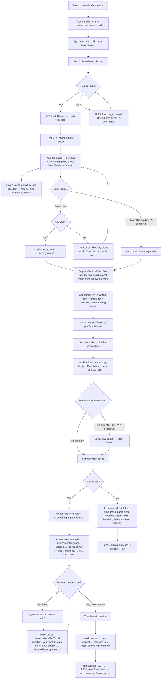
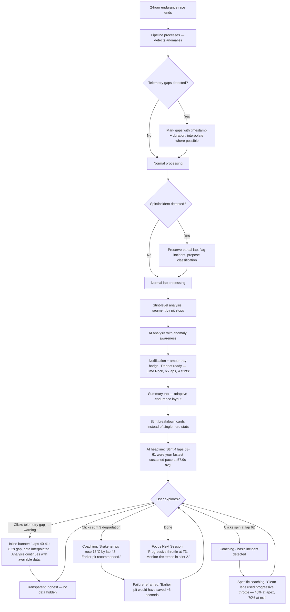

# UX Design Specification - AI Race Team

**Author:** Joe
**Date:** 2026-02-02

---

<!-- UX design content will be appended sequentially through collaborative workflow steps -->

## Executive Summary

### Project Vision

AI Race Team is a desktop-first application that automatically captures iRacing telemetry and delivers AI-powered coaching debriefs. It replaces fragmented manual workflows — capture in one tool, analyze in another, share via screenshots, discuss on Discord with no data context — with a single unified loop: capture → pre-processing → AI coaching → visualization → conversation → sharing.

The product vision is "Your AI crew chief that sees what you can't, speaks when it matters, and never locks away your data." The innovation isn't any single feature — it's the integrated experience at zero-config quality. Replicating the full loop at this depth is a multi-year effort.

Built on Tauri 2.0 (Rust core + web view), the application targets Windows-first (iRacing is Windows-only) with a web companion planned for Phase 2 debrief sharing.

### Target Users

**Primary — The Obsessed Improver (Joe archetype):**
Experienced sim racers who race weekly in leagues and want data-driven improvement. They've tried VRS (confusing), Coach Dave (data locked), Garage61 (limited). They know they're leaving time on the table but can't see exactly where or why. Technical enough to have an API key but don't want to configure software — they want to race and get coached.

**Secondary — The League Newcomer (Marcus archetype):**
Mid-pack racers who want to improve but find traditional telemetry tools intimidating. They need plain-English coaching, not squiggly lines. Many use VR and need async debrief workflows — they can't interact with dashboards while wearing a headset. The AI needs to explain things visually without requiring telemetry literacy.

**Tertiary — Team Managers & League Admins (Future):**
Multi-driver teams needing comparison views, stint optimization, and incident reconstruction. Phase 3 scope — the UX foundation must not preclude these workflows but doesn't need to design for them now.

### Key Design Challenges

1. **Racing context transition** — Users arrive at the debrief from an intense racing session (adrenaline, frustration, VR fatigue). The UX must deliver the headline insight immediately, respect cognitive state, and support the VR-to-monitor transition gracefully (notification → click → debrief, no alt-tab required).

2. **Invisible-to-active state change** — The application operates silently in the system tray during racing and must surface seamlessly when the debrief is ready. This transition from "silent recorder" to "coaching interface" is the product's most critical UX moment.

3. **AI trust through grounding** — Every coaching insight must show its work (specific lap numbers, pressure values, distances, speeds) without cluttering the narrative. Racers won't follow advice they can't verify against their own experience.

4. **Progressive complexity** — Plain-English coaching for newcomers and per-corner data overlays for veterans must coexist in the same interface. The UX must support progressive disclosure without feeling like two separate tools.

5. **Conversational-visual hybrid** — The debrief blends dashboard elements (telemetry charts, lap traces, statistics) with conversational AI coaching and follow-up. These modalities must feel integrated, not like a dashboard bolted onto a chatbot.

6. **Screenshot-native design** — At MVP, sharing means screenshots to Discord. Every debrief view must be visually compelling and self-explanatory when captured as a static image — clear hierarchy, data-rich but readable at Discord resolution.

### Design Opportunities

1. **The "aha moment"** — When a racer sees their brake trace overlaid on the fast lap and *understands visually* why there's a 0.4s gap. Designing this moment to be visceral and immediate is the product's emotional hook and the key differentiator over text-only coaching.

2. **Zero-config as competitive moat** — Install → auto-detect iRacing → paste API key → race → get coached. Under 3 minutes from download to ready. This simplicity, contrasted against competitors' setup complexity, is both a UX win and a marketing story.

3. **Session memory as coaching relationship** — "Your brake pressure at T1 improved from 37% avg last week to 52% today." The AI builds a coaching relationship over time. The UX reinforces this through progress visualization, trend indicators, and session-over-session storytelling.

4. **Implicit training plans** — Every debrief ends with "work on X next session." This isn't a feature to build separately — it's an AI output pattern baked into the coaching flow. The UX simply needs to make this recommendation prominent and trackable across sessions.

## Core User Experience

### Defining Experience

The core user action is **opening a post-session debrief and understanding where time was lost.** The product loop is race → debrief → learn → race better. Everything else — capture, pre-processing, AI analysis — is invisible infrastructure serving this moment.

The absolutely critical interaction: **the debrief landing view.** Within 5 seconds of opening, the user must see their headline performance summary, the AI's top coaching insight, and a clear path to dig deeper. If this moment fails, the product fails.

What must be completely effortless: **everything before the debrief.** Capture, pre-processing, AI analysis — all invisible. The user's only action is "finish racing, click notification."

### Platform Strategy

**Primary: Windows desktop (Tauri 2.0)**
- iRacing is Windows-only — no cross-platform needed for capture
- System tray background operation during racing
- Mouse/keyboard interaction for debrief (post-VR)
- Offline-capable for all core features (capture, pre-processing, debrief viewing)
- AI analysis requires internet (BYOK API calls) but degrades gracefully to local stats

**Secondary: Web browser (Phase 2)**
- Debrief sharing and viewing — no install needed for recipients
- Same React codebase as Tauri frontend
- Mobile-friendly for checking debriefs on phone (requires web upload infrastructure — local data is not internet-accessible until users can upload sessions to the product's website)
- SQLite via WASM (sql.js) for client-side data

**Platform-specific capabilities to leverage:**
- Windows system tray + notifications (VR-friendly surface area)
- OS credential store for API key security
- Shared memory for iRacing telemetry (fastest path, most channels)
- Tauri's native file system access for Parquet/SQLite storage

### Effortless Interactions

1. **Telemetry capture** — Zero user action. App detects iRacing, starts recording, handles disconnects, preserves partial data. The user never thinks about capture.

2. **Session end → debrief ready** — Automatic. iRacing stops, Rust pipeline processes, AI analyzes, notification pops. No prominent "import session" or "run analysis" buttons in main UI. Power users can manually trigger debrief via system tray menu option.

3. **Onboarding** — Install → auto-detect iRacing → paste API key → done. Under 3 minutes. No account creation, no cloud setup, no configuration wizards.

4. **Corner investigation** — See the AI says "you're losing 0.4s at T5" → click T5 → see the brake/throttle trace with annotation. One click from insight to evidence.

5. **Conversational follow-up** — Ask "why was Lap 60 faster?" in natural language, get a grounded answer referencing specific telemetry. No query syntax, no filter menus.

### Critical Success Moments

1. **The debrief notification** (make-or-break): User finishes racing, takes off VR headset, sees "Debrief ready — Lime Rock, 25 laps, best 57.8s." If this notification is clear and clickable, the product loop begins. If it's missed or confusing, the session goes unanalyzed.

2. **First AI insight** (aha moment): The AI says something the racer didn't know about their own driving. "You under-braked in every zone — avg 37% pressure, best lap used 90%." This is the moment trust is built or lost. The insight must be specific, verifiable, and surprising.

3. **Visual confirmation** (emotional hook): The racer sees their brake trace vs the fast lap and *understands visually* why there's a time gap. Text coaching validated by visual evidence. This is when "I need this tool" crystallizes.

4. **Session comparison** (retention hook): "Your brake pressure at T1 improved from 37% avg last week to 52% today." The AI remembers. Progress is visible. The racer has a reason to come back after every session.

5. **First-time success** (onboarding): Marcus installs, races 15 minutes, gets a debrief that says something useful in plain English. If the first debrief is confusing, generic, or requires telemetry literacy, Marcus churns immediately.

### Experience Principles

1. **Race first, analyze after** — The product never interrupts racing. It's invisible during sessions and surfaces only when the racer is ready. The debrief is async by design, not a compromise.

2. **Show, don't just tell** — Every coaching insight has a visual counterpart. Text says "you braked late at T5," the chart shows exactly where and by how much. The combination is more powerful than either alone.

3. **Coaching first, data second** — The product is an AI coach first and a telemetry data viewer second. Coaching narrative leads the experience; telemetry visualization supports it as evidence and is always available for users who want to explore the data directly. Users should feel coached, not overwhelmed with charts. Progressive disclosure: headline → insight → evidence → raw data.

4. **Your data, always** — No lock-in, no cloud dependency for core features, open formats. The UX never creates anxiety about data access or portability. Export is a first-class feature, not an afterthought.

5. **One click deeper** — From any coaching insight, the supporting evidence is exactly one interaction away. From the debrief summary to a specific corner's telemetry trace: one click. From an AI claim to the specific lap data: one click. Depth is always available but never forced.

## Desired Emotional Response

### Primary Emotional Goals

**"I have an unfair advantage."** — The racer feels like they have access to a professional-grade coaching resource that their competitors don't. The AI sees patterns in their driving they couldn't see themselves. This isn't just a tool — it's having a crew chief who watches every lap.

**"I know exactly what to work on."** — No more vague sense of "I need to get faster." The debrief replaces uncertainty with specificity. The racer leaves every session with a concrete, actionable focus area for next time. Clarity replaces confusion.

**"I'm actually improving."** — Session-over-session progress is visible and celebrated. The AI remembers, tracks, and reflects improvement back. The racer feels momentum and investment in their own development arc.

### Emotional Journey Mapping

| Stage | Desired Emotion | Anti-Emotion to Avoid |
|---|---|---|
| **Discovery/Install** | "This looks simple" — Relief, curiosity | Overwhelm, skepticism ("another complicated tool") |
| **First race with app** | "I forgot it was running" — Invisible confidence | Anxiety about performance impact, distraction |
| **Debrief notification** | "Let's see what I missed" — Anticipation, eagerness | Dread ("another thing to review"), apathy |
| **Reading AI coaching** | "Holy shit, it's right" — Surprise, trust | Skepticism ("generic advice"), confusion ("what does this mean?") |
| **Visual confirmation** | "NOW I see it" — Visceral understanding, aha | Overwhelm ("too many charts"), disconnection ("so what?") |
| **Conversational follow-up** | "It actually understands my session" — Engagement, depth | Frustration ("it forgot what I asked"), robotic responses |
| **Session comparison** | "I'm getting better" — Pride, motivation | Discouragement (no visible progress), data overload |
| **Something goes wrong** | "It handled that gracefully" — Trust maintained | Data loss anxiety, broken trust, blame |
| **Returning next session** | "I know what to focus on" — Purpose, anticipation | Forgetting what the AI said, loss of continuity |

### Micro-Emotions

**Confidence over confusion** — The most critical axis. Every screen, every insight, every interaction must make the user feel they understand what they're looking at. If a newcomer ever thinks "I don't know what this means," the design has failed at that point. Progressive disclosure is the tool: coaching headline first, evidence on demand.

**Trust over skepticism** — Sim racers are data-literate and will verify claims. The AI must earn trust by showing its work. The emotion isn't blind faith — it's "I checked, and it's right." The UX supports verification without requiring it.

**Accomplishment over frustration** — Every debrief should end with the user feeling they learned something actionable. Even a bad session (spins, disconnects, tire degradation) should produce useful coaching. The AI reframes failures as learning opportunities: "Your clean laps in stint 4 were your fastest — here's why."

**Anticipation over dread** — The debrief notification should trigger "let's see what I can learn" not "ugh, another thing to review." The debrief must be fast to consume (headline insight in 5 seconds) with optional depth. It respects the user's time and post-race energy.

### Design Implications

| Emotion | UX Design Approach |
|---|---|
| "I have an unfair advantage" | AI insights feel personalized and specific, not generic. Reference actual lap numbers, corner names, pressure values. Never produce advice that could apply to any driver. |
| "I know what to work on" | Every debrief ends with a prominent, single "Focus Next Session" recommendation. Not buried in text — visually distinct, memorable, and referenced when the user returns. |
| "I'm actually improving" | Progress indicators on the session history view. Trend arrows on key metrics. The AI explicitly calls out improvements: "Your T1 braking improved 15% since last week." |
| Confidence | Clear visual hierarchy. No jargon without context. Coaching language at grade 8-10 reading level. Newcomers can understand without feeling talked down to. |
| Trust | Every AI claim has a "show evidence" path (one click to the supporting telemetry). The AI never makes unsupported assertions. Confidence grounding is visible. |
| Anticipation | Debrief notification includes a teaser: "Best lap 57.8s — AI found 3 corners to improve." Enough to create curiosity, not enough to overwhelm. |
| Graceful failure | Telemetry gaps marked with explanation, not hidden. Partial laps preserved with AI diagnosis. The app never loses data silently. Errors are honest and recoverable. |

### Emotional Design Principles

1. **Specificity builds trust** — Generic coaching ("brake harder") destroys trust. Specific coaching ("your average brake pressure at T5 was 42% — your best lap used 78%") builds it. Every interaction must feel like the AI actually analyzed *your* session, not produced a template.

2. **Progress is the product** — The emotional payoff isn't a single debrief — it's the arc across sessions. Design every interaction to reinforce the sense of forward motion. Session history isn't an archive — it's a progress timeline.

3. **Failures are coaching moments** — A spin, a disconnect, a bad stint — these aren't data errors to hide. They're the most coachable moments. The UX must treat anomalies as opportunities, not problems. "Here's why you spun" is more valuable than "Lap 62: incomplete."

4. **Respect post-race energy** — Users arrive emotionally spent (win or lose). The debrief must be consumable in 30 seconds (headline + top insight) or 30 minutes (full corner-by-corner analysis). The user controls the depth, not the product.

5. **Invisible until valuable** — During racing, zero presence. At debrief time, immediate presence. The emotional tone shifts from "I forgot it was there" to "this is exactly what I needed." The transition must feel natural, not jarring.

## UX Pattern Analysis & Inspiration

### Inspiring Products Analysis

**1. Strava — The "session memory" social coaching app**

What it does well:
- **Activity feed as progress timeline** — Every run/ride is a card with headline stats. You see your history as forward momentum, not an archive. This maps directly to our session history view.
- **Segment analysis** — Strava breaks routes into segments and shows your performance per segment with personal records. Directly analogous to our per-corner analysis.
- **Social proof through sharing** — Activity cards are screenshot-friendly and shareable. Clean hierarchy: distance, time, map, stats. This is our Discord screenshot target.
- **"Relative Effort" simplification** — Complex data (heart rate zones, power curves) reduced to a single understandable number. Model for how we simplify telemetry for newcomers.
- **Progressive disclosure** — Summary card → tap for details → tap for specific segment → tap for raw data. Exactly our "one click deeper" principle.

**2. GitHub Copilot / Cursor — AI-integrated tool UX**

What it does well:
- **AI as inline assistant, not separate tool** — The AI lives inside the workflow, not in a sidebar you have to context-switch to. Our conversational follow-up should feel integrated into the debrief, not like "now switch to the chat tab."
- **Confidence through transparency** — Copilot shows you the suggestion; you accept or reject. The AI's work is visible and verifiable. Maps to our "show your work" grounding principle.
- **Progressive AI involvement** — Tab-complete (light touch) → chat (medium) → agent mode (deep). Users control how much AI they engage with. Our equivalent: headline insight (automatic) → read coaching (on demand) → conversational follow-up (user-initiated).

**3. MoTeC i2 — The gold standard of motorsport telemetry visualization**

What it does well:
- **Channel overlay with lap comparison** — Multiple telemetry traces overlaid on the same time/distance axis. The established pattern for brake/throttle visualization. Our 1D lap-distance chart should feel familiar to anyone who's seen MoTeC.
- **Cursor sync across charts** — Hover on one trace, see the corresponding point on all others. Essential for correlating brake input with speed loss with steering angle.
- **Math channels** — Derived data computed from raw telemetry. Maps to our corner segmentation and derived metrics.

What it does poorly (anti-pattern):
- **Expert-only UX** — Configuration-heavy, steep learning curve, no guidance on what to look at. The opposite of our "coaching first" principle.

**4. Peloton / Whoop — Fitness coaching that builds relationship over time**

What it does well:
- **Weekly/monthly progress summaries** — "This week vs last week" with trend arrows and contextual coaching. Directly applicable to our session-over-session comparison.
- **Personalized recommendations** — "Based on your recovery, we recommend..." The AI adapts to your data. Our "Focus Next Session" recommendation follows this pattern.
- **Streak/consistency reinforcement** — Visual indicators of consistency and improvement over time. Supports our "I'm actually improving" emotional goal.

### Transferable UX Patterns

**Navigation Patterns:**
- **Strava's activity feed model** → Session history as a timeline of cards, newest first. Each card shows: track, car, date, best lap, AI headline insight. Click to open full debrief.
- **Tab-based debrief sections** → Summary | AI Coaching | Telemetry | Chat. User lands on Summary, moves to depth on demand. No forced linear flow.

**Interaction Patterns:**
- **Strava's segment tap-to-detail** → Click a corner name in the AI coaching text to jump to that corner's telemetry view. The coaching narrative is the navigation.
- **Copilot's inline AI** → Conversational follow-up lives at the bottom of the debrief view (not a separate page). The chat has full context of what the user is looking at.
- **MoTeC's cursor sync** → Hover on the 1D distance chart syncs a marker across all visible traces. Essential for understanding cause-and-effect in telemetry.

**Visual Patterns:**
- **Strava's summary cards** → Clean, screenshot-friendly debrief headers. Track name, car, lap count, best time, AI headline — all in a compact, shareable format.
- **Peloton's progress arrows** → Trend indicators on session history. Green up-arrow on metrics that improved, red down-arrow on regressions. Instant visual progress signal.
- **Dark theme default** — Sim racing tools universally use dark themes (iRacing, ACC, MoTeC). The debrief should feel native to the racing ecosystem, not like a productivity app.

### Anti-Patterns to Avoid

1. **VRS's "wall of squiggly lines"** — Presenting raw telemetry traces without coaching context. Users stare at data without knowing what matters. Our coaching narrative must always lead; telemetry supports.

2. **Coach Dave's data hostage model** — Locking user data inside the app. Even the perception of lock-in creates negative emotion. Export must be prominent, not buried in settings.

3. **MoTeC's configuration maze** — Requiring users to set up workspaces, channels, layouts before seeing anything useful. Our zero-config principle means the first debrief works with zero user setup.

4. **Generic AI advice** — "Try braking later" with no specificity. This is the fastest way to destroy trust. Every insight must reference the user's actual data or not appear at all.

5. **Separate analysis tool** — Requiring users to export data from one tool and import into another. The unified loop is the product. If any step requires manual hand-off, the UX has failed.

6. **Notification spam** — Over-notifying during or after racing. One notification when the debrief is ready. That's it. No "capture started," no "processing," no "AI thinking." Invisible until valuable.

### Design Inspiration Strategy

**What to Adopt:**
- Strava's session card → timeline navigation model (proven for activity-based products)
- MoTeC's synchronized cursor across telemetry traces (industry standard, expected by power users)
- Peloton's trend arrows and progress indicators (proven engagement pattern)
- Dark theme as default (ecosystem-native for sim racing)
- Progressive disclosure pattern: summary → coaching → evidence → raw data

**What to Adapt:**
- Strava's social feed → our session history (remove social layer, keep the card-based timeline)
- Copilot's inline AI → our conversational follow-up (adapt from code context to racing context)
- Peloton's "Focus Next Session" → our training recommendation (adapt from fitness to driving technique)
- MoTeC's channel overlay → our 1D lap-distance chart (simplify for non-expert users, add AI annotations)

**What to Avoid:**
- VRS/MoTeC's expert-first approach (conflicts with "coaching first, data second")
- Any data export friction (conflicts with "your data, always")
- Configuration wizards or workspace setup (conflicts with zero-config)
- Separate pages for AI vs data (conflicts with conversational-visual hybrid goal)
- Light/bright default theme (conflicts with sim racing ecosystem expectations)

## Design System Foundation

### Design System Choice

**Tailwind CSS + shadcn/ui** — A themeable system that provides full visual control with proven, accessible component primitives. This combination gives a solo developer the speed of a component library with the customization freedom of a custom system.

- **Tailwind CSS 4.x** for utility-first styling, built-in dark mode, and custom design tokens
- **shadcn/ui** (Radix UI primitives) for accessible, copy-paste components that are owned code, not dependencies
- **Independent charting layer** (TBD — uPlot or custom Canvas) for telemetry visualization

### Rationale for Selection

1. **No imposed visual identity** — Unlike MUI or Ant Design, Tailwind/shadcn don't fight you when building a dark, data-dense, racing-native aesthetic. The output looks like *your* product.

2. **Solo developer velocity** — shadcn provides proven patterns (tabs, cards, dialogs, dropdowns, tooltips) without building accessible components from scratch. Copy-paste model means no version lock-in or dependency hell.

3. **Charting independence** — The design system doesn't constrain the telemetry visualization layer. The 1D lap-distance chart, cursor sync, and multi-lap overlay can use whatever rendering approach performs best.

4. **Lightweight footprint** — Tailwind purges unused CSS. No heavy component library bundle. Matters for Tauri's lightweight desktop shell.

5. **Dark theme native** — Tailwind's built-in dark mode classes make dark-first design trivial. No theme override hacks.

### Implementation Approach

| Layer | Technology | Role |
|---|---|---|
| **CSS Framework** | Tailwind CSS 4.x | Utility classes, dark theme, responsive, custom design tokens |
| **Component Primitives** | Radix UI (via shadcn/ui) | Accessible, unstyled base components (dialogs, dropdowns, tabs, tooltips) |
| **Component Library** | shadcn/ui (copied into project) | Pre-built, customizable components styled with Tailwind. Owned code. |
| **Charting** | TBD (uPlot or custom Canvas likely for performance) | Telemetry visualization — independent of design system |
| **Icons** | Lucide React (shadcn default) | Consistent, lightweight icon set |
| **Design Tokens** | Tailwind config + CSS custom properties | Colors, spacing, typography, border radius — single source of truth |

### Customization Strategy

**Design tokens to define (Tailwind config):**
- **Color palette:** Dark-first. Racing-native. Accent colors for data traces (green = best lap, gray = average, red = regression). Status colors for system tray (green/yellow/red).
- **Typography:** Clean, readable at small sizes for data-dense views. Monospace for telemetry values. Sans-serif for coaching text.
- **Spacing:** Compact for data views (telemetry, lap tables), generous for coaching text (readability).
- **Border radius:** Subtle — rounded corners but not bubbly. The aesthetic is technical-premium, not consumer-friendly.

**Custom components to build (beyond shadcn):**
- Session card (Strava-inspired timeline card)
- Debrief header (screenshot-friendly summary block)
- Telemetry chart (1D distance plot with cursor sync — bespoke)
- Corner annotation overlay (AI callouts on chart)
- Coaching panel (AI text with clickable corner references)
- Chat input (conversational follow-up)
- Progress indicator (trend arrows, session-over-session)
- System tray status (native Tauri integration, not web component)

**What shadcn provides out of the box:**
- Tabs (debrief sections: Summary | Coaching | Telemetry | Chat)
- Cards (session history, lap summary)
- Dialog/Sheet (settings, API key setup, export)
- Dropdown Menu (context menus, lap selection)
- Tooltip (hover data on charts)
- Input + Button (chat input, search, filters)
- Toast (notifications within the app)
- Scroll Area (long coaching text, session history)

## Defining Experience

### The Core Interaction

**"Open a debrief and the AI tells you exactly where you lost time — then you see it."**

If a user describes this product to a league mate, they'll say: "I raced, opened the app after, and it told me I was under-braking at T5 by 35%. I clicked on it and could see my brake trace vs my best lap. I could literally see the gap."

The AI insight + visual confirmation in one flow. Not two separate features — one continuous experience where text coaching and visual evidence reinforce each other in a single scroll.

### User Mental Model

**How users currently solve this problem:**
- **Manual Claude Desktop workflow (Joe):** Export telemetry CSV → paste into Claude → read text analysis → no visuals, no memory, manual every time
- **VRS:** Open telemetry viewer → stare at traces → try to figure out what matters → no guidance on what to look at
- **MoTeC:** Configure workspace → load session → compare channels manually → expert-only, steep curve
- **Nothing (most racers):** Race → "I think I was slow at T3?" → no data, no confirmation, gut feeling only

**Mental model they bring:** Users expect something like a sports coach reviewing game film. "Show me the replay, point at the mistake, tell me what to do differently." They don't expect to configure the film room first.

**Where confusion happens:**
- Telemetry traces without context ("what am I looking at?")
- AI advice without evidence ("why should I believe this?")
- Too many options at once ("which lap? which corner? which metric?")
- Technical jargon ("trail braking phase duration" vs "you released the brake too early")

### Success Criteria

| Criteria | Measurement |
|---|---|
| User sees headline insight within 5 seconds of opening debrief | Time from window open to first coaching text visible |
| User can identify their weakest corner within 15 seconds | Time from debrief open to corner-specific insight consumption |
| User can see visual evidence for any AI claim in one click | Interaction count from coaching text to supporting chart |
| Newcomer understands first debrief without telemetry knowledge | Beta test: >90% "understood the advice" on first session |
| User shares screenshot within first week | Organic sharing behavior during beta |
| User returns after next session to check progress | Session-over-session return rate |

### Novel UX Patterns

**This product combines familiar patterns in a novel way.** No single interaction is new — coaches review film, telemetry tools show traces, AI chatbots answer questions. The innovation is the *integration*:

**Established patterns adopted:**
- Dashboard summary cards (Strava) — Session overview as landing view
- Telemetry trace overlay (MoTeC) — Brake/throttle vs distance chart
- Chat interface (ChatGPT/Copilot) — Conversational follow-up at bottom of view
- Progressive disclosure (any good mobile app) — Summary → detail → raw data

**Novel combination that needs no education:**
- AI coaching text contains **clickable corner references** — click "T5" in the coaching narrative and the telemetry chart scrolls/zooms to T5. The coaching text *is* the navigation. Users don't need to learn this — clickable text is universal. But the connection between coaching and visualization is the magic.
- **Debrief as a single scrollable view** — Not tabs, not separate pages. Summary at top, AI coaching in the middle, chart below, chat at the bottom. The user scrolls through a coached experience, not navigates between disconnected panels. *(Tabs available for power users who want to isolate views, but the default is the unified scroll.)*

### Experience Mechanics

**1. Initiation — How the debrief starts:**
- System tray notification: "Debrief ready — Lime Rock, 25 laps, best 57.8s"
- User clicks notification (or tray icon → latest debrief)
- Window opens to the debrief landing view
- *No loading spinner* — local pre-processed stats appear instantly. AI coaching streams in progressively (NFR6a).

**2. Interaction — The core flow:**
- **Headline block** (top of view): Track, car, laps, best time, session-over-session delta, "Focus Next Session" from last debrief (if returning user)
- **AI coaching section** (scrolling into view): Structured coaching narrative. Top finding first ("You're under-braking in 4 of 7 corners"). Per-corner breakdown with clickable corner names. Each insight has a telemetry reference.
- **Telemetry chart** (below coaching): 1D lap-distance chart showing brake/throttle traces. Best lap (green) vs average (gray). Corner zone labels. AI annotation markers at key points.
- **Cursor sync**: Hover on chart highlights the corresponding coaching insight. Click a corner name in coaching scrolls the chart.
- **Chat input** (bottom): "Ask about your session..." — persistent, always available. User types natural language, AI responds with context from the full debrief.

**3. Feedback — How users know it's working:**
- AI coaching text appears progressively (not all at once) — feels like the coach is thinking
- Clicking a corner name smoothly scrolls the chart and highlights the zone — visual confirmation of connection
- Hover on chart shows exact values in tooltip (speed, brake %, throttle %, lap time delta)
- Session comparison delta shows green/red arrows on every metric — instant progress signal
- "Focus Next Session" recommendation is visually prominent — the user knows their takeaway

**4. Completion — What success looks like:**
- User has read the coaching headline and understands their top weakness
- User has clicked at least one corner to see the visual evidence
- User has (optionally) asked a follow-up question and gotten a grounded answer
- The "Focus Next Session" recommendation is clear in their mind
- User closes the debrief feeling informed and motivated — "I know what to work on"
- *(Optional)* User screenshots the headline block or a coaching insight for Discord

## Visual Design Foundation

### Color System

**Dark-first palette** — Racing-native aesthetic. No light mode at MVP. The sim racing ecosystem (iRacing, ACC, MoTeC, VRS) universally uses dark interfaces. The debrief should feel native to this world, not like a productivity app opened by mistake.

**Background Tokens:**

| Token | Value | Usage |
|---|---|---|
| `bg-base` | `#0A0A0F` | Application background, main canvas |
| `bg-surface` | `#141419` | Cards, panels, elevated containers |
| `bg-elevated` | `#1E1E26` | Dropdowns, tooltips, modals, nested cards |

**Text Tokens:**

| Token | Value | Usage |
|---|---|---|
| `text-primary` | `#F4F4F5` | Headings, coaching text, primary content |
| `text-secondary` | `#B4B4BB` | Metadata, labels, supporting text (~5.5:1 contrast ratio on dark bg for post-VR readability) |
| `text-muted` | `#71717A` | Timestamps, disabled states, tertiary info |

**Border Tokens:**

| Token | Value | Usage |
|---|---|---|
| `border-default` | `#27272A` | Card edges, section dividers, input borders |
| `border-subtle` | `#1E1E26` | Minimal separation lines, nested containers |

**Accent Colors:**

| Token | Value | Usage |
|---|---|---|
| `accent-primary` | `#F59E0B` | Primary interactive elements, brand emphasis, links — vivid amber for racing-native energy (pit lane lights, caution flags, tachometer warmth) |
| `accent-hover` | `#D97706` | Hover/active states for accent elements |

**Telemetry Trace Colors:**

| Token | Value | Usage |
|---|---|---|
| `trace-best` | `#22C55E` | Best lap overlay, positive deltas, improvement indicators |
| `trace-average` | `#71717A` | Average/reference lap overlay |
| `trace-regression` | `#EF4444` | Regression indicators, time-loss markers |

**Semantic Colors:**

| Token | Value | Usage |
|---|---|---|
| `success` | `#22C55E` | Positive outcomes, improvements, completion states |
| `warning-bg` | `#F59E0B/10%` | Warning background tint (explicitly differentiated from accent amber) |
| `warning-text` | `#FBBF24` | Warning text (lighter amber, distinct from accent) |
| `error` | `#EF4444` | Errors, failures, critical alerts |
| `info` | `#3B82F6` | Informational states, neutral highlights |

**Amber/Warning Differentiation Rule:** Accent amber (#F59E0B) is reserved for interactive elements and brand emphasis (buttons, links, active states). Warning states use tinted background (#F59E0B at 10% opacity) + lighter text (#FBBF24). This prevents semantic confusion between "click this" and "be careful."

### Typography System

**Primary typeface — Inter** (UI text, coaching narratives, headings)
Clean, highly readable across all sizes, excellent for both data-dense views and long-form coaching text. Widely available, renders well on Windows. *Alternative to evaluate during implementation: Geist Sans (Vercel) — similar metrics with slightly more character for developer/tool aesthetics.*

**Monospace typeface — JetBrains Mono** (telemetry values, lap times, data tables)
Tabular figures, distinct character differentiation (0 vs O, 1 vs l), excellent at small sizes. Industry standard for data-heavy interfaces.

**Type Scale:**

| Token | Size | Line Height | Usage |
|---|---|---|---|
| `text-3xl` | 30px | 36px | Page titles (rarely used — debrief view has no page title) |
| `text-2xl` | 24px | 32px | Section headers, session debrief title |
| `text-xl` | 20px | 28px | **Top coaching insight headline** — hero moment, minimum size for the single most important text on screen |
| `text-lg` | 18px | 28px | Sub-section headers, corner names in coaching |
| `text-base` | 16px | 24px | Coaching body text, descriptions, conversational AI responses |
| `text-sm` | 14px | 20px | Metadata, labels, telemetry values in context |
| `text-xs` | 12px | 16px | Timestamps, tertiary info, dense table cells (minimum accessible size) |

**Font Weight Scale (constrained):**

| Weight | Value | Usage | Rule |
|---|---|---|---|
| `font-normal` | 400 | Body text, coaching paragraphs, descriptions | Default weight for all content |
| `font-medium` | 500 | Labels, secondary headings, metadata, corner names | Subtle emphasis without shouting |
| `font-semibold` | 600 | Section headings, card titles, debrief headers | Structural hierarchy |
| `font-bold` | 700 | **Top coaching insight headline only** | One bold element per view. Never use for anything except the single hero insight. |

### Spacing & Layout Foundation

**Base unit: 4px** — All spacing derives from this unit. Provides enough granularity for both dense telemetry views and generous coaching layouts.

**Spacing Scale:**

| Token | Value | Usage |
|---|---|---|
| `space-1` | 4px | Inline element gaps, icon-to-text spacing |
| `space-2` | 8px | Tight element groups, telemetry row spacing |
| `space-3` | 12px | Related element spacing, compact list items |
| `space-4` | 16px | Standard padding, card internal spacing |
| `space-6` | 24px | Section padding, coaching paragraph spacing |
| `space-8` | 32px | Major section gaps, page-level spacing |
| `space-12` | 48px | Page margins, large section separations |

**Component Spacing Tokens:**

| Token | Value | Usage |
|---|---|---|
| `card-padding` | `space-4 (16px)` | Internal padding for all card components |
| `section-gap-coaching` | `space-8 (32px)` | Between major coaching sections |
| `section-gap-data` | `space-4 (16px)` | Between telemetry/data sections |
| `paragraph-gap` | `space-6 (24px)` | Between coaching paragraphs within a section |
| `chart-gutter` | `space-3 (12px)` | Between chart canvas and surrounding annotations/labels |

**Dual-Density Layout Principle:**
- **Coaching zones** (AI narrative, session summary, recommendations): Relaxed spacing — `space-6` to `space-8` between elements. Approachable, readable, friendly coach feel. Serves Marcus archetype's need for breathing room.
- **Telemetry/data zones** (charts, lap tables, corner breakdowns): Compact spacing — `space-2` to `space-3` between elements. Dense, efficient, professional tool feel. Serves Joe archetype's need for information density.
- The same view can contain both zones — coaching text above with generous spacing, telemetry chart below with compact density. The transition between zones should feel natural, not jarring.

**Layout Principles:**
- Maximum content width: 1200px (coaching readability on wide monitors)
- Sidebar (if used): 280-320px fixed width
- Charts: Full available width within content area
- Grid: 12-column for layout flexibility, but most views are single-column scroll

**Border Radius:**

| Token | Value | Usage |
|---|---|---|
| `radius-sm` | 4px | Buttons, inputs, small interactive elements |
| `radius-md` | 6px | Cards, panels, content containers |
| `radius-lg` | 8px | Modals, dialogs, large containers |

**Elevation (Shadows):**
Minimal shadow use — dark UIs rely on background color layering (bg-base → bg-surface → bg-elevated) rather than drop shadows. Shadows reserved for floating elements only (dropdowns, tooltips, modals) using subtle `0 4px 12px rgba(0,0,0,0.5)`.

### Accessibility Considerations

**Contrast Ratios:**
- text-primary (#F4F4F5) on bg-base (#0A0A0F): ~18:1 (exceeds AAA)
- text-secondary (#B4B4BB) on bg-base (#0A0A0F): ~5.5:1 (exceeds AA, approaches AAA)
- text-muted (#71717A) on bg-base (#0A0A0F): ~4.6:1 (meets AA for large text; use at text-sm+ only)
- accent-primary (#F59E0B) on bg-base (#0A0A0F): ~8.5:1 (exceeds AA). Interactive elements using amber buttons use white text on amber bg for full compliance.

**Keyboard Navigation:**
- All interactive elements accessible via Tab/Shift+Tab
- Radix UI primitives (via shadcn/ui) provide built-in keyboard handling for complex components (dropdowns, dialogs, tabs)
- Custom telemetry chart: arrow keys for corner-to-corner navigation, Escape to deselect

**Focus Indicators:**
- Visible focus ring: 2px solid accent-primary (#F59E0B) with 2px offset
- High contrast against all background layers
- Never removed — `:focus-visible` used to show only on keyboard navigation

**Scaling:**
- All typography in `rem` units for user font-size preferences
- Layout responds to zoom levels up to 200% without horizontal scroll
- Minimum touch/click target: 44x44px for interactive elements (future mobile readiness)

## Design Direction Decision

### Design Directions Explored

Six distinct layout approaches were generated and evaluated, each applying the same visual foundation (dark-first palette, amber accent, Inter + JetBrains Mono, dual-density spacing) to different layout philosophies:

1. **The Storyteller** — Single-column scrollable narrative. Coaching flows like an article with embedded charts. Maximum focus, minimal chrome.
2. **The Command Center** — Multi-panel layout with sidebar navigation. Dense, information-rich, power-user oriented. Everything visible simultaneously.
3. **The Conversational Coach** — Chat-forward interface. AI coaching appears as conversational messages with embedded data cards. Most novel approach.
4. **The Dashboard** — Card-grid layout. Summary stat cards, coaching insight cards, telemetry below. Familiar, scannable pattern.
5. **The Split Screen** — Fixed dual-pane layout. Coaching text left, telemetry chart right, always visible. Maximum coaching-to-evidence correlation.
6. **The Focused Flow** — Tab-based navigation with full-screen focused sections. Clean separation of concerns with bold section indicators.

### Chosen Direction

**"The Structured Debrief"** — A hybrid combining elements from Focused Flow (primary), Dashboard (summary), and Command Center (depth).

**Primary navigation:** Tab bar — Summary | Coaching | Telemetry | Chat input persistent across all tabs.

**Summary tab (Dashboard-inspired):**
- Hero stat cards in a row: Best Lap, Session Delta, Laps Completed, Focus Area
- AI coaching headline card (full width, text-xl bold, the hero moment)
- Session-over-session progress indicators (trend arrows, Peloton-inspired)
- Screenshot-optimized: this tab IS the Discord screenshot

**Coaching tab (Command Center-inspired):**
- Sidebar with corner shortcuts (T1-T7 quick navigation) and session metadata
- Main panel: detailed AI coaching analysis with per-corner breakdowns
- Clickable corner names link to telemetry evidence
- Dense but readable — uses compact spacing for data, relaxed for coaching text

**Telemetry tab (Command Center-inspired):**
- Full-width 1D lap-distance chart with brake/throttle traces
- Corner zone labels, best lap (green) vs average (gray) overlay
- Compact data panels below chart: lap table, corner-by-corner stats
- Cursor sync: hover on chart shows exact values in tooltip

**Persistent chat input:**
- Collapsible input bar at the bottom of every tab
- User can ask follow-up questions from any context
- AI responses appear inline, maintaining context of what the user is viewing

### Design Rationale

1. **Tabs provide clarity** — Users always know "where they are" in the debrief. No confusion about navigation state. Each tab has a clear purpose and optimized layout.
2. **Dashboard summary respects post-race energy** — The Summary tab delivers the headline in 5 seconds via scannable cards. Tired users get value immediately.
3. **Command Center depth rewards investigation** — The Coaching and Telemetry tabs provide the density and detail that experienced racers want, without cluttering the entry point.
4. **Persistent chat preserves context** — Moving chat from a dedicated tab to a persistent input means the user never loses context when asking a follow-up question.
5. **Progressive disclosure via tab depth** — Summary (light) → Coaching (medium) → Telemetry (deep). Each tab is a deeper level of engagement, matching the "one click deeper" principle.
6. **Screenshot-native Summary** — The Dashboard-style Summary tab with card grid is inherently screenshot-friendly for Discord sharing.

### Implementation Approach

- Tab bar component: shadcn/ui Tabs with amber active indicator
- Summary cards: shadcn/ui Card with custom stat layouts
- Coaching sidebar: fixed 280px panel with scroll area for corner shortcuts
- Telemetry chart: independent charting layer (uPlot or custom Canvas), full-width
- Chat input: custom component, collapsible, persistent across tab changes via layout wrapper
- Responsive behavior: tabs stack on narrow viewports; sidebar collapses to hamburger; cards go single-column

## User Journey Flows

### Journey 1: Joe — The Happy Path Debrief

**Entry point:** System tray notification (or tray badge fallback) after race ends
**Goal:** Understand where time was lost, see the evidence, know what to work on next

**Flow:**

**Key interaction moments:**
- **5-second rule:** Summary tab delivers local stats instantly, AI headline streams within 5-10 seconds
- **Tray badge persistence:** Amber dot + tooltip ensures VR users never miss a debrief
- **Two-phase loading:** Local stats first (instant), AI coaching second (streaming). If AI fails, local-only view is still valuable
- **Corner-zoom navigation:** Click corner name → Telemetry tab centers on that zone with ~200m context
- **Lap picker:** Default best vs average, power users select any two laps to compare
- **Confidence indicators:** Subtle icon/shade on per-corner insights. Low confidence visually muted. Dismiss/report available **[DEFERRED TO GROWTH]**
  - **MVP Scope:** AI coaching insights displayed without confidence scoring or dismissal UI
  - **Growth Scope:** Confidence indicators with visual weighting and user dismissal/feedback (PRD FR199, PRD:221)
- **Collapsible chat:** Defaults to collapsed after first 5 sessions (saves screen space for power users)
- **Adaptive Summary:** Sprint sessions show single hero cards. Endurance sessions (>45 min or >1 pit stop) show stint breakdown cards automatically

### Journey 2: Marcus — First-Time Onboarding

**Entry point:** Downloads app after seeing a league mate's screenshot
**Goal:** Install, race, get useful coaching in plain English — no telemetry knowledge required

**Flow:**

**Key design decisions for Marcus:**
- **3-step onboarding maximum:** Detect iRacing → AI key (or skip) → done. Under 3 minutes
- **"Skip for now" is a real button:** Equal visual weight to "Add key." No guilt, no friction
- **Local-only debrief is valuable:** Lap time graph, basic stats, consistency metrics. Coaching area shows blurred preview + CTA — motivation to add key
- **Plain English coaching:** AI adapts language to skill level. "Brake harder" not "42% vs 78% pressure"
- **Conversational AI:** Chat responses are warm and coaching-like, not robotic or statistical
- **10+ lap guidance:** Mentioned in onboarding. Short sessions still provide basic value + encouragement
- **Progress line graph:** Best lap per session, simple line chart, prominent on Summary tab. Marcus's killer retention feature
- **Chat defaults to open:** For first 5 sessions, chat is visible and inviting. Marcus's safety net

### Journey 3: Joe — The Bad Session (Edge Case Recovery)

**Entry point:** Same as Journey 1, but session includes telemetry gaps, tire degradation, and a spin
**Goal:** Extract coaching value from an imperfect session — failures become learning moments

**Flow:**

**Key design decisions for bad sessions:**
- **Never hide problems:** Telemetry gaps shown with honest inline banners, not silently discarded
- **Partial data is valuable:** Spin laps preserved and analyzed, not treated as corrupt
- **Adaptive endurance layout:** Summary tab auto-switches to stint breakdown cards for long sessions
- **Incident classification:** AI proposes driver error / external factor. User can override. Overrides excluded from coaching recommendations. Data captured for future AI improvement **[DEFERRED TO GROWTH]**
  - **MVP Scope:** Basic incident detection (FR16) - identify spins/crashes/disconnects, preserve partial laps
  - **Growth Scope:** Advanced classification with user override, coaching exclusion logic (PRD:201-204)
- **Pit stop annotations:** User can mark fuel-only / tire change / both. AI adapts tire degradation analysis accordingly **[DEFERRED TO GROWTH]**
  - **MVP Scope:** Stint detection and lap grouping only
  - **Growth Scope:** Pit stop type annotation, tire degradation analysis, pit strategy recommendations (PRD:201-204)
- **Failures = coaching moments:** Every anomaly reframed as learning. "Here's why you spun" > "Lap 62: incomplete"
- **Graceful degradation chain:** Full AI → AI slow (local stats first) → AI unavailable (local-only) → Capture failed (failure notification with explanation)

### System Tray Icon State System

The tray icon is the product's persistent surface area — always visible, always honest about state.

| State | Icon | Tooltip | Meaning |
|---|---|---|---|
| **Idle** | Gray circle | "AI Race Team — Waiting for iRacing" | App running, no active session |
| **Recording** | Green circle | "Recording — Lime Rock, lap 14..." | Active telemetry capture in progress |
| **Processing** | Amber pulse | "Processing session..." | Post-session pipeline running |
| **Debrief ready** | Amber circle + badge | "Debrief ready — Lime Rock, 25 laps, best 57.8s" | New debrief available, click to open |
| **Error** | Red circle | "Capture error — [details]" | Something went wrong, click for info |

### Journey Patterns

**Navigation Patterns:**
- **Entry is always the Summary tab** — regardless of session type. Layout adapts (sprint vs endurance) but entry point is consistent
- **Corner names are navigation** — clickable everywhere they appear. Click → Telemetry tab centers on that corner zone with ~200m context
- **Tab bar is persistent** — always visible, amber underline on active tab. Never hidden
- **Tray icon is always accessible** — one click to session list from tray, one more click to any debrief

**Feedback Patterns:**
- **Two-phase loading** — Local stats instant, AI streams progressively. Users see value immediately
- **Hover = preview, click = navigate** — Consistent across all interactive elements
- **Amber for interaction, green/red for data** — No semantic confusion between UI elements and performance signals
- **Confidence indicators** — Subtle icon/shade on AI insights. Low-confidence visually muted. Dismiss available **[DEFERRED TO GROWTH - see Journey 1 for scope]**

**Adaptive Patterns:**
- **Coaching language adapts to skill level** — Newcomer: plain English ("brake harder"). Veteran: data-specific ("42% vs 78%"). Set during onboarding or auto-detected
- **Summary layout adapts to session length** — Sprint: hero cards. Endurance: stint breakdown cards
- **Chat visibility adapts to user maturity** — Open by default for first 5 sessions, collapsed after. User can toggle manually
- **Local-only mode is meaningful** — Without API key: lap time graph, basic stats, coaching teaser. Full value chain without AI, motivation to add key

**Error/Edge Case Patterns:**
- **Warnings are inline, not modal** — Telemetry gaps, partial laps, anomalies shown as inline banners
- **Honest messaging** — "Data interpolated for 8.2s gap" not "Error"
- **Incident classification with override** — AI proposes, user confirms or overrides. Overrides respected **[DEFERRED TO GROWTH - see Journey 3 for scope]**
- **Graceful degradation:** Full AI → AI slow (local first) → AI unavailable (local-only) → No API key (capture + stats + teaser) → Capture failed (notification + explanation)

### Flow Optimization Principles

1. **Zero clicks to value** — Summary tab loads with headline insight visible. No "click to reveal"
2. **Maximum 2 clicks to any data point** — Summary → Coaching tab → corner click → Telemetry centered on zone
3. **Chat never resets context** — Switching tabs doesn't clear the chat. AI maintains conversation across navigation
4. **Session list is one interaction away** — Tray icon → session list. Never more than one interaction to access previous debriefs
5. **Onboarding is destructible** — 3-step setup never appears again after completion. No "welcome back" screens on return visits
6. **Failures are coaching moments** — Every anomaly reframed as learning. Never a dead end, always value
7. **Smart defaults that evolve** — Chat visibility, coaching language depth, detail level all adapt over time based on user behavior

## Component Strategy

### Design System Components (shadcn/ui)

Components available from the chosen design system and their usage in AI Race Team:

| Component | Usage |
|---|---|
| **Tabs** | Primary navigation: Summary \| Coaching \| Telemetry |
| **Card** | Session cards, hero stat cards, stint breakdown cards, coaching insight cards |
| **Button** | Primary actions, API key setup, chat send |
| **Input** | Chat input, search, API key paste field |
| **Dialog/Sheet** | Settings, API key setup, export options |
| **Dropdown Menu** | Lap picker, session selection, context menus |
| **Tooltip** | Chart hover data, corner details, tray icon tooltip |
| **Toast** | In-app notifications (debrief ready, capture status) |
| **Scroll Area** | Long coaching text, session history list, corner sidebar |
| **Badge** | Confidence indicators, trend arrows, corner tags |
| **Separator** | Section dividers within tabs |
| **Collapsible** | Chat input collapse/expand |
| **Progress** | AI streaming indicator, session processing |
| **Alert** | Telemetry gap warnings, capture errors, inline banners |
| **Toggle** | Settings preferences |

### Custom Components

Components not available in shadcn/ui that must be built for AI Race Team:

#### 1. Session Card

**Purpose:** Timeline entry for session history. Primary navigation element for accessing past debriefs.
**Content:** Track name, car, date/time, lap count, best lap time, session delta (vs previous), AI headline insight (one line), session type badge (practice/race/endurance)
**Actions:** Click to open debrief. Right-click for context menu (export, delete, share).
**States:** Default, hover (subtle bg lift), active/selected (amber left border), new/unread (amber dot badge), loading (skeleton)
**Variants:** Compact (list mode), expanded (card mode with more stats)
**Accessibility:** Focusable, Enter to open, arrow keys to navigate list, screen reader announces track + date + best lap

#### 2. Debrief Header / Hero Block

**Purpose:** Screenshot-native summary block at the top of the Summary tab. This IS the Discord screenshot.
**Content:** Track name + layout, car name, session date, lap count, best lap time (large, prominent), session delta with trend arrow (green up / red down), "Focus Next Session" badge from previous debrief (if returning user), AI coaching headline (text-xl bold)
**Actions:** Click delta to see session comparison. Click "Focus" badge to see previous recommendation.
**States:** Default, streaming (AI headline animates in), local-only (stats visible, coaching area shows teaser)
**Variants:** Sprint (single hero row), endurance (stint breakdown sub-cards)
**Accessibility:** Semantic headings, trend arrow has aria-label ("improved by 0.4 seconds")

#### 3. Telemetry Chart (1D Lap-Distance Plot)

**Purpose:** Core visualization. Brake/throttle traces vs lap distance with corner zones and multi-lap overlay.
**Content:** X-axis: lap distance (0 to track length). Y-axis: input percentage (0-100%). Traces: brake (red area), throttle (green area). Corner zone labels (T1-T7) as vertical dashed lines. AI annotation markers at key points.
**Actions:** Hover for tooltip (exact values: speed, brake %, throttle %, delta). Click corner zone to highlight and zoom. Pan/zoom with mouse. Cursor sync with coaching text.
**States:** Default (best vs avg overlay), zoomed (corner-zoom with ~200m context), comparing (two user-selected laps), loading (skeleton trace), no-data (message explaining why)
**Variants:** Full-width (Telemetry tab), embedded mini (coaching insight card)
**Accessibility:** Keyboard arrow keys for corner-to-corner navigation, Escape to reset zoom, data table alternative for screen readers
**Technology:** Independent layer — uPlot or custom Canvas for performance. Not a shadcn component.

#### 4. Corner Annotation Overlay

**Purpose:** AI coaching callouts overlaid on or adjacent to the telemetry chart. Connects coaching text to specific chart locations.
**Content:** Corner name (T5), AI insight summary ("Under-braking by 36%"), ~~confidence indicator (high/med/low)~~ **[Growth]**, small trend arrow if session comparison available
**Actions:** Click to expand full coaching detail for that corner. Hover to highlight corresponding chart zone. ~~Dismiss (X) for low-confidence insights~~ **[Growth]**.
**States:** Default, highlighted (when cursor syncs from coaching text), expanded (full detail), ~~dismissed, low-confidence (muted visual)~~ **[Growth]**
**Accessibility:** Focusable, Enter to expand, Escape to dismiss. Aria-live for dynamic content.

#### 5. Coaching Panel

**Purpose:** Structured AI coaching narrative with clickable corner references. Main content of the Coaching tab.
**Content:** Per-corner coaching blocks. Each block: corner name (clickable), AI insight text, supporting data points (brake %, speed, delta), ~~confidence indicator~~ **[Growth]**. Overall session narrative at top.
**Actions:** Click corner name → Telemetry tab zooms to that corner. Hover corner name → coaching block highlights. Scroll through full analysis.
**States:** Default, streaming (text appearing progressively), corner-highlighted (when user hovers chart), local-only (coaching area shows teaser)
**Variants:** Full (Coaching tab), condensed (Summary tab headline card)
**Accessibility:** Semantic headings per corner. Corner links announce "Navigate to Turn 5 telemetry." Progressive streaming uses aria-live polite.

#### 6. Corner Sidebar

**Purpose:** Quick navigation panel in the Coaching tab. Lists all corners with status indicators.
**Content:** Corner names (T1-T7), time delta per corner (green/red), severity indicator (how much time lost/gained), coaching status (analyzed / ~~low-confidence~~ **[Growth]** / no data)
**Actions:** Click corner → main panel scrolls to that corner's coaching. Click → Telemetry tab zooms to corner.
**States:** Default, active corner highlighted (amber), corner with issues (red accent), corner with improvement (green accent)
**Accessibility:** Navigation landmark, arrow keys to move between corners, Enter to select.

#### 7. Persistent Chat Input

**Purpose:** Always-available conversational follow-up input. Present at the bottom of every tab.
**Content:** Text input field, send button, conversation history (expandable)
**Actions:** Type question, send, receive AI response inline. Expand to see full conversation. Collapse to minimal bar.
**States:** Collapsed (small "Ask about your session..." bar), expanded (full input + conversation), streaming (AI response appearing), disabled (no API key — shows CTA)
**Variants:** Collapsed (default after 5 sessions), open (default for first 5 sessions)
**Accessibility:** Focusable, Enter to send. Conversation uses aria-live for new messages. Escape to collapse.

#### 8. Progress Line Graph

**Purpose:** Session-over-session best lap time trend. Marcus's retention feature.
**Content:** X-axis: session dates. Y-axis: best lap time. Line connecting data points. Track name labels. Trend direction indicator.
**Actions:** Hover point for tooltip (date, track, best lap, delta). Click point to open that session's debrief.
**States:** Default, hover (point highlighted), insufficient data (< 2 sessions — shows encouraging message), multi-track (filter by track or show all)
**Variants:** Summary card (compact, last 5 sessions), full view (settings/history page, all sessions)
**Accessibility:** Data table alternative. Point descriptions announced on focus.

#### 9. Tray Status Indicator

**Purpose:** System tray icon with dynamic state. The product's persistent surface area.
**Content:** Icon state (idle/recording/processing/ready/error), tooltip text, badge (debrief count)
**Actions:** Left-click: open latest debrief or session list. Right-click: context menu (quit, settings, session list)
**States:** Idle (gray), Recording (green), Processing (amber pulse), Debrief ready (amber + badge), Error (red)
**Technology:** Native Tauri tray API — not a web component. State driven from Rust backend.

### Component Implementation Strategy

**Build approach:**
- All custom web components built with React + Tailwind CSS using established design tokens
- shadcn/ui components copied into project (owned code, not dependency)
- Telemetry Chart and Progress Line Graph use independent charting layer (uPlot or custom Canvas)
- Tray Status Indicator uses native Tauri APIs, state synchronized with frontend via Tauri event system
- All components follow established patterns: amber for interaction, green/red for data signals, dual-density spacing

### Implementation Roadmap

**Phase 1 — MVP Core (Journey 1 happy path):**
1. Telemetry Chart — the product's centerpiece visualization
2. Debrief Header / Hero Block — the 5-second value delivery
3. Coaching Panel — the AI narrative experience
4. Session Card — timeline navigation
5. Persistent Chat Input — conversational follow-up
6. Tray Status Indicator — background operation surface

**Phase 2 — MVP Complete (Journey 2 + 3 support):**
7. Corner Sidebar — coaching navigation for dense sessions
8. Corner Annotation Overlay — chart-coaching connection
9. Progress Line Graph — retention feature for newcomers

**Phase 3 — Enhancement:**
- Component variants (compact session cards, embedded mini-charts)
- Advanced chart interactions (multi-lap selection, export)
- Session comparison overlay components

## UX Consistency Patterns

### Button Hierarchy

**Primary Action (Amber CTA):**
- **When to Use:** One per view — the single most important action (e.g., "Start Debrief," "Ask AI," "Save Setup")
- **Visual:** `bg-accent-primary text-black font-semibold rounded-lg px-6 py-3`
- **Behavior:** Solid amber fill, subtle scale on hover (1.02), disabled state at 40% opacity
- **Rule:** If two buttons compete for primary, one becomes secondary — no exceptions

**Secondary Action (Outline):**
- **When to Use:** Supporting actions alongside a primary (e.g., "Export," "Compare," "Filter")
- **Visual:** `border border-accent-primary text-accent-primary bg-transparent rounded-lg px-4 py-2`
- **Behavior:** Border glow on hover, fill on active press

**Tertiary Action (Ghost):**
- **When to Use:** Low-priority or repeated actions (e.g., "Dismiss," "Show more," pagination)
- **Visual:** `text-text-secondary hover:text-text-primary bg-transparent px-3 py-1.5`
- **Behavior:** Text-only, underline on hover

**Destructive Action (Red):**
- **When to Use:** Irreversible operations (e.g., "Delete Session," "Reset All Data")
- **Visual:** `bg-red-600 text-white font-semibold rounded-lg` — never amber
- **Behavior:** Requires confirmation modal with explicit typed confirmation for bulk deletes

**Button Sizing:**
- Default: `h-10 px-4` (most contexts)
- Compact: `h-8 px-3 text-sm` (table rows, inline actions)
- Large: `h-12 px-6 text-lg` (hero CTAs, empty states)

### Feedback Patterns

**AI Streaming Feedback:**
- Coaching text streams word-by-word with a blinking amber cursor `▊`
- Skeleton paragraph lines show before first token arrives
- "AI is analyzing your session..." status with animated amber dots
- If streaming stalls >5s: "Still thinking..." with option to retry

**Success Feedback:**
- Toast notification: slides in from bottom-right, auto-dismisses after 4s
- Green left-border accent on toast: `border-l-4 border-green-500`
- Examples: "Session saved," "Setup exported," "Telemetry connected"

**Error Feedback:**
- Inline alert below the trigger element — never a toast for errors
- Red left-border: `border-l-4 border-red-500 bg-red-500/10`
- Always includes: what went wrong + what to do next
- API key errors: link directly to Settings with the field highlighted
- AI errors: "AI couldn't generate a response. Try rephrasing or check your API key."

**Warning Feedback:**
- Amber banner at the top of the relevant section
- `bg-accent-primary/10 border border-accent-primary/30 text-text-primary`
- Used for: degraded mode notices, outdated data, missing optional config

**Info Feedback:**
- Subtle inline text below elements: `text-text-secondary text-sm`
- No border, no background — just helpful context
- Used for: "Last synced 2 min ago," "3 sessions this week"

### Loading & Empty States

**Two-Phase Loading Pattern:**
- **Phase 1 (Instant):** Local telemetry stats render immediately from Rust — lap times, tire data, fuel numbers appear in < 200ms
- **Phase 2 (Progressive):** AI coaching streams in over 3-15s — skeleton blocks in Coaching tab, word-by-word streaming in Summary
- Visual separator: Phase 1 content has full opacity; Phase 2 areas show skeleton pulse animation `animate-pulse bg-bg-elevated`

**Skeleton Patterns:**
- Session Card skeleton: rounded rect for car image, 3 text lines, status badge placeholder
- Debrief skeleton: hero block with shimmer, 3 tab placeholders, content area pulse
- Chart skeleton: axis lines + grid visible, data area pulses

**Empty States:**
- **No Sessions:** Illustration of empty garage + "Ready to race? Your first session debrief starts here." + Primary CTA to documentation
- **No AI Key:** "Running in local mode — telemetry data only." + Secondary CTA "Add AI key for coaching insights"
- **No Telemetry Connection:** "Waiting for iRacing..." + animated connection dots + troubleshooting link
- **Empty Search/Filter:** "No sessions match your filters" + ghost button "Clear filters"

**Loading Indicators:**
- Page-level: thin amber progress bar at top of window (like YouTube/GitHub)
- Component-level: skeleton shimmer within the component bounds
- Action-level: button spinner replacing label text, button disabled during load
- Never: full-screen spinner or blocking modal for any load state

### Navigation Patterns

**Tab Navigation:**
- Active tab: amber underline `border-b-2 border-accent-primary text-text-primary`
- Inactive tab: `text-text-secondary hover:text-text-primary` — no underline
- Tab transitions: underline slides to active tab (150ms ease)
- Debrief tabs: Summary | Coaching | Telemetry — always this order, always visible

**Corner Navigation:**
- Corner names are always clickable links in any context they appear
- Click a corner name → navigates to that corner's detail view
- Corner badges show status: green (data complete), amber (partial), gray (no data)

**Session List Navigation:**
- Session list is always one click away from any debrief view (breadcrumb or back arrow)
- Breadcrumb: `Sessions > [Car] @ [Track] > Debrief` — each segment clickable
- Session list preserves scroll position and filters when returning

**Keyboard Navigation:**
- `Tab` cycles through interactive elements in logical reading order
- `Escape` closes any modal, popover, or expanded panel
- `Ctrl/Cmd + K` opens command palette (future enhancement)
- Arrow keys navigate within tab groups and lists
- `Enter` activates focused element

### Data Visualization Patterns

**Hover Interaction:**
- Crosshair cursor on all charts — vertical line snaps to nearest data point
- Tooltip appears above crosshair: shows exact value, lap number, and delta if comparing
- All charts in the same view sync their crosshairs (cursor sync)

**Corner-Zoom Pattern:**
- Click any corner annotation on a chart → zooms to that corner's telemetry range
- Zoom transition: 300ms ease-out
- "Reset zoom" ghost button appears in top-right of chart when zoomed
- Double-click chart background to reset zoom

**Lap Time Formatting:**
- Always `M:SS.mmm` format (e.g., `1:32.456`)
- Delta times: `+0.234` (red) or `-0.156` (green) — sign always shown
- Personal best: amber highlight on the time value
- Session best: bold + amber

**Chart Color Coding:**
- Current lap: `accent-primary` (amber)
- Comparison lap: `#60A5FA` (blue-400)
- Personal best reference: `#A855F7` (purple-400) dashed line
- Danger zones (lockups, spins): `#EF4444` (red-500) shaded region

### Notification & Interruption Patterns

**Tray Notifications:**
- One notification per completed session — never more
- Content: "[Car] @ [Track] — Debrief ready" + click to open
- Zero notifications during active racing (iRacing fullscreen detected)
- Notification auto-dismisses from OS tray after 30s

**In-App Notifications:**
- Toast stack: maximum 2 visible at once, newest on top
- Toasts auto-dismiss after 4s (success) or persist until dismissed (errors)
- Toast position: bottom-right, 16px from edges, 8px gap between stacked toasts

**Interruption Policy:**
- **Never interrupt:** Active racing, AI streaming in progress, form entry in progress
- **Gentle notify:** Background session processing complete, update available
- **Immediate show:** Critical errors (telemetry disconnected, API key revoked), user-initiated actions complete

**Modal Usage Rules:**
- Modals only for: destructive confirmations, first-time setup wizard, BYOK key entry
- Never for: informational content, settings changes, navigation
- All modals: close on Escape, close on backdrop click, trap focus within

## Responsive Design & Accessibility

### Responsive Strategy

**Platform Context:** AI Race Team is a Tauri 2.0 desktop application — no mobile or tablet layouts required. Responsive design focuses on window resizing behavior, since users may run the app alongside iRacing in split-screen or full-screen for detailed analysis.

**Compact Window (< 900px):**
- Single-column layout — content stacks vertically
- Sidebar collapses to icon rail with tooltips
- Charts shrink to fit with reduced axis labels
- Tab bar remains horizontal but uses icons + abbreviated labels
- Persistent Chat collapses to floating amber button

**Standard Window (900px – 1440px):**
- Default layout as designed in all previous steps
- Tab-based debrief with full sidebar
- Charts at comfortable analysis width (min 600px chart area)
- Full navigation breadcrumbs visible

**Wide Window (> 1440px):**
- Expanded data density — potential side-by-side panels
- Charts expand with more granular grid lines
- Session list can show as permanent sidebar alongside debrief
- Increased whitespace for breathing room at large sizes

### Breakpoint Strategy

**Container-First Approach:**
Use CSS container queries over viewport media queries — components respond to their container size, not the window. This enables consistent behavior whether a component appears in the main panel, a sidebar, or a modal.

**Breakpoints:**
- `compact`: container < 600px
- `standard`: container 600px – 1000px
- `wide`: container > 1000px

**Window Minimum Size:** 800 × 600px enforced by Tauri window config. Below this, the app cannot meaningfully display debrief content.

**Cross-Platform WebView Considerations:**
- macOS: WebKit (Safari engine) — test flexbox/grid edge cases
- Windows: WebView2 (Chromium) — more predictable CSS behavior
- Normalize rendering differences with CSS resets and explicit property declarations

### Accessibility Strategy

**Compliance Target: Basic WCAG 2.1 AA (keyboard navigation + contrast compliance)**

**MVP Scope:** Semantic HTML structure, full keyboard navigation support, and contrast ratio compliance (4.5:1 for normal text, 3:1 for large text). Screen reader optimization and full ARIA label implementation are deferred to post-MVP to reduce initial development cost while maintaining a solid accessibility foundation.

Chosen because:
- Establishes baseline accessibility without blocking MVP delivery
- Post-VR readability requirements already push design toward strong contrast
- Keyboard navigation critical for power users and accessibility alike
- Reduces future rework costs by embedding accessibility from day one
- Screen reader optimization can be added incrementally post-MVP based on user feedback

**Color & Contrast:**
- All text meets 4.5:1 contrast ratio minimum against its background
- `text-primary` (#F4F4F5) on `bg-base` (#0A0A0F) = 18.3:1
- `text-secondary` (#B4B4BB) on `bg-base` (#0A0A0F) = 10.4:1
- `accent-primary` (#F59E0B) on `bg-base` (#0A0A0F) = 8.9:1
- `accent-primary` (#F59E0B) as text on black button background = verified AA
- Chart colors never rely on color alone — use line style (solid/dashed/dotted) + shape markers

**Keyboard Navigation:**
- Full keyboard accessibility for all interactive elements
- Logical tab order follows visual reading flow (left-to-right, top-to-bottom)
- Visible focus rings: `ring-2 ring-accent-primary ring-offset-2 ring-offset-bg-base`
- Focus trap in modals — Tab cycles within modal, Escape closes
- Skip link at top of app: "Skip to main content" (visible on focus)
- Arrow keys for tab groups, chart data point navigation, and list selection

**Screen Reader Support:** *(Deferred to Post-MVP)*
- **MVP Baseline:** Semantic HTML with proper heading hierarchy (h1 app title, h2 sections, h3 subsections) — inherits default screen reader support from Taui WebView
- **Post-MVP Enhancements:** Comprehensive ARIA labels on icon-only buttons, chart elements, status badges, tray state; live regions (`aria-live="polite"`) for AI streaming text, toast notifications, loading state changes; chart text summaries alongside visuals; tab switch announcements
- **Rationale:** Screen reader optimization requires significant testing effort and specialist QA. Deferring to post-MVP allows focused delivery while maintaining structural foundation for future enhancement

**Motion & Sensory:**
- Respect `prefers-reduced-motion`: disable chart animations, skeleton pulse, streaming cursor blink, tab slide transitions
- No content conveyed solely through animation
- Audio cues (if any future feature) always paired with visual indicator
- No auto-playing media or flashing content

### Testing Strategy

**Responsive Testing:**
- Test at window sizes: 800x600, 1024x768, 1440x900, 1920x1080, 2560x1440
- Verify layout transitions at each breakpoint boundary
- Test rapid window resizing for layout thrash/reflow issues
- Cross-platform: macOS WebKit + Windows WebView2 rendering comparison

**Accessibility Testing:** *(MVP Scope - Keyboard + Contrast)*
- Automated: axe-core integration in development builds for CI/CD checks (keyboard + contrast violations only)
- Manual keyboard-only: navigate full session to debrief to coaching to settings flow without mouse
- Contrast checker: verify all color token combinations against WCAG AA thresholds (4.5:1 normal text, 3:1 large text)
- Color blindness simulation: deuteranopia, protanopia, tritanopia — verify chart readability
- **Post-MVP:** Screen reader testing with VoiceOver (macOS) and NVDA (Windows) for full user journey

**Acceptance Criteria:** *(MVP Scope)*
- Zero axe-core violations at "serious" or "critical" level (keyboard + contrast rules only)
- Complete debrief flow achievable via keyboard only (Tab, Enter, Escape, Arrow keys)
- All interactive elements have visible focus indicators meeting WCAG contrast requirements
- All text meets minimum contrast ratios: 4.5:1 (normal), 3:1 (large text)
- Charts readable under all color blindness simulations (line styles + shape markers, not color alone)
- **Post-MVP:** Screen reader can convey all essential content and state changes

### Implementation Guidelines

**Responsive Development:**
- Use `rem` units for all spacing and sizing (inherits system font preferences)
- CSS container queries (`@container`) for component-level responsiveness
- Tailwind responsive prefixes mapped to container breakpoints via plugin
- Charts: use responsive container with `aspect-ratio` to maintain proportions
- Optimize asset sizes for Tauri bundle

**Accessibility Development:** *(MVP Scope)*
- Semantic HTML: `<main>`, `<nav>`, `<aside>`, `<section>` with proper landmark roles
- Form inputs: visible labels (not placeholder-only)
- Focus management: after modal close, return focus to trigger element
- Skip link: first focusable element in DOM, visually hidden until focused
- **Post-MVP Enhancements:**
  - Every `` gets descriptive `alt` text; decorative images get `alt=""`
  - `aria-describedby` for form help text
  - Error messages: `aria-invalid="true"` + `aria-describedby` pointing to error text
  - Comprehensive ARIA labels for complex components

**Developer Checklist (Per Component):**
1. Keyboard navigable? Tab/Enter/Escape/Arrow keys work correctly
2. Screen reader announces purpose and state?
3. Color contrast passes AA for all text/background combinations?
4. Works at compact/standard/wide container sizes?
5. Respects `prefers-reduced-motion`?
6. No information conveyed by color alone?
